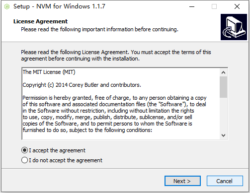

# 1 学习过程

所有Vue.js项目都是在Webpack框架下进行开发的。

## 框架学习的一般顺序

1. 安装
2. 新建一个页面
3. 做一些简单变量的渲染
4. 实现页面跳转（路由）
5. 实现页面间参数的传递（路由）
6. 实现真实的http请求
7. 提交表单
8. 使用一些技巧让代码层次化（组件）

# 2 NVM、NPM、Node

## 2.1 NVM：Node版本管理器

### 下载：https://github.com/coreybutler/nvm-windows/releases 

 下载nvm-setup.zip ，此版本为安装版本，本次实验下载的是1.1.7

## 2.2 安装NVM

1. 双击nvm-setup.exe文件，开始安装

2. 选择nvm安装路径

3. 设置nvm快捷方式位置

4. 开始安装

5. nvm安装完成

6. 检查环境变量路径配置是否正确

7. 启动运行窗口

8. 检测nvm是否安装成功

9. 关闭运行窗口，配置nvm配置文件

10. 配置nvm配置文件。默认情况下，使用nvm安装node时会连接国外服务器，速度较慢，因此通过修改配置文件方式改成连接国内的镜像服务器。打开nvm安装目录的配置文件settings.txt，进行如下配置。

## 2.3 安装Nodejs和npm

1. 启动运行窗口，查看可用nodejs版本

2. 选择待安装版本进行安装

3. 检测nodejs和npm是否安装成功

## 2.4 安装Webpack

1. 全局安装Webpack

   

2. 检测Webpack是否安装成功

   

